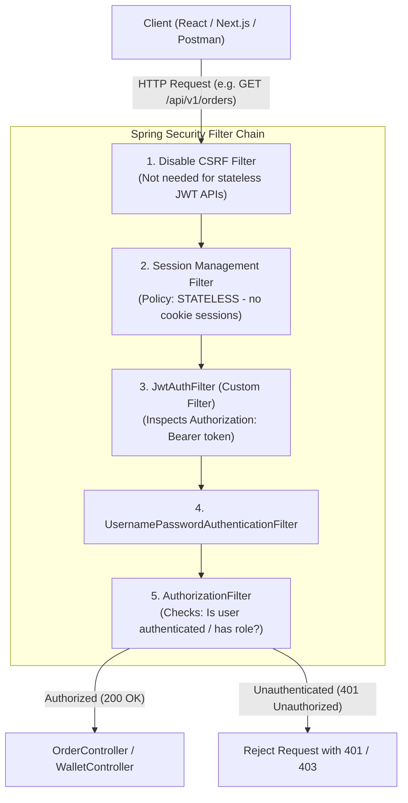

# Guide 03: Spring Security Architecture & Filter Chain

> **Purpose**: This guide explains how **Spring Security** works in plain, simple English with real-world analogies, visual flow diagrams, and direct comparisons to **PHP Laravel / Node.js** ecosystems. Even a non-technical reader can follow every concept from start to finish.

---

## 1. Non-Technical Analogy: How Spring Security Works

Imagine an **Exclusive VIP Airport Lounge**:

```
                       REAL WORLD ANALOGY: VIP AIRPORT LOUNGE
                       
  Visitor (Client)                 Airport Main Entrance              VIP Lounge (Controller)
       │                                     │                                  │
       │  1. Arrives at entrance             │                                  │
       ├────────────────────────────────────►│                                  │
       │                                     │ 2. Security Checkpoints (Filters)│
       │                                     │   • Checkpoint 1: Metal Detector │
       │                                     │   • Checkpoint 2: ID & Passport  │
       │                                     │   • Checkpoint 3: VIP Wristband  │
       │                                     │                                  │
       │                                     │ 3. If Valid: Gate Opens ────────►│ Welcome!
       │                                     │                                  │
       │                                     │ 4. If Invalid: Security Escort   │
       │◄────────────────────────────────────┼─── "401 Unauthorized / No Entry" │
```

1. **The Client (Browser / Mobile App / Postman)** is a passenger arriving at the airport.
2. **The Security Filter Chain (`SecurityFilterChain`)** is the series of mandatory checkpoints (metal detector, passport check, luggage scanner) before anyone is allowed inside.
3. **The Public Whitelist (`requestMatchers("/api/v1/auth/**").permitAll()`)** is the public lobby where anyone can walk in to buy a ticket (register or login).
4. **The Protected Endpoints (`/api/v1/orders`, `/api/v1/wallet`)** are the private VIP lounges that require showing a valid VIP badge (JWT token).
5. **`SecurityContextHolder`** is the passenger's temporary VIP badge pinned to their shirt while they walk around inside.

---

## 2. Laravel / Node.js vs Spring Security Mental Model

If you are coming from **PHP Laravel**, **Express.js**, or **Next.js**, here is how every Spring Security concept maps to what you already know:

| Real-World Role | PHP / Laravel | Node / Express / Next.js | Spring Boot | What it does in Plain English |
| :--- | :--- | :--- | :--- | :--- |
| **The Security Checkpoint** | Middleware pipeline (`app/Http/Middleware/*`) | Middleware (`app.use(...)`) | **`SecurityFilterChain`** | Intercepts HTTP requests *before* they reach your controller. |
| **Custom Filter / Middleware** | Custom Middleware (`handle($request, $next)`) | `(req, res, next) => {}` | **`OncePerRequestFilter` (`JwtAuthFilter`)** | Runs custom logic (like reading JWT headers) once per request. |
| **Who is logged in?** | `Auth::user()` / `$request->user()` | `req.user` | **`SecurityContextHolder`** | Stores the identity of the currently authenticated user in memory for this request. |
| **Credential Verifier** | `Auth::attempt($credentials)` | Passport.js `authenticate()` | **`AuthenticationManager`** | Verifies username & password against the database. |
| **Password Hasher** | `Hash::make()` / `bcrypt()` | `bcrypt.hash()` | **`BCryptPasswordEncoder`** | Converts plain-text passwords into secure cryptographic hashes. |
| **Database User Finder** | `EloquentUserProvider` (`config/auth.php`) | Custom database query | **`CustomUserDetailsService`** | Tells the security system how to load user records from MySQL. |
| **Public vs Protected Routes** | Route Groups / Middleware exclusion | Route Middleware | **`authorizeHttpRequests`** | Sets which URLs are open to the public and which require a login token. |

---

## 3. Visual Architecture: The Spring Security Filter Chain

Every incoming HTTP request travels down a pipeline of filters before reaching the `@RestController`:



---

## 4. Line-by-Line Code Breakdown: `SecurityConfig.java`

File: [`src/main/java/com/example/order_management/config/SecurityConfig.java`](file:///c:/Users/ASUS/Desktop/Projects/test/order-management/src/main/java/com/example/order_management/config/SecurityConfig.java)

```java
@Configuration
@EnableWebSecurity
@EnableMethodSecurity
@RequiredArgsConstructor
public class SecurityConfig {

    private final JwtAuthFilter jwtAuthFilter;
    private final CustomUserDetailsService userDetailsService;
```

### What does each annotation mean?
* **`@Configuration`**: Tells Spring Boot: *"This file contains bean definitions and configuration settings for the app."*
* **`@EnableWebSecurity`**: Activates Spring Security's web protection across all incoming HTTP routes.
* **`@EnableMethodSecurity`**: Allows method-level permission checks like `@PreAuthorize("hasRole('ADMIN')")` on individual controller endpoints.
* **`@RequiredArgsConstructor`**: Lombok automatically creates a constructor for all `private final` fields, applying the **Dependency Inversion Principle (DIP)**.

---

### Step 1: Whitelisting Public Endpoints

```java
private static final String[] PUBLIC_WHITELIST = {
        // Swagger / OpenAPI documentation assets
        "/v3/api-docs/**",
        "/v3/api-docs.yaml",
        "/swagger-ui/**",
        "/swagger-ui.html",

        // System health check
        "/api/v1/health",

        // Public Authentication endpoints (Register / Login)
        "/api/v1/auth/**"
};
```
* **Why**: When a brand-new user visits your app, they don't have a JWT token yet. They **must** be allowed to access `/api/v1/auth/register` and `/api/v1/auth/login` without being rejected.

---

### Step 2: Configuring the Filter Chain (`SecurityFilterChain`)

```java
@Bean
public SecurityFilterChain securityFilterChain(HttpSecurity http) throws Exception {
    return http
            // 1. Disable CSRF (Cross-Site Request Forgery)
            .csrf(csrf -> csrf.disable())

            // 2. Set Stateless Session Management
            .sessionManagement(session -> session.sessionCreationPolicy(SessionCreationPolicy.STATELESS))

            // 3. Define URL Authorization Rules
            .authorizeHttpRequests(auth -> auth
                    .requestMatchers(PUBLIC_WHITELIST).permitAll()
                    .anyRequest().authenticated()
            )

            // 4. Set the authentication provider
            .authenticationProvider(authenticationProvider())

            // 5. Add our custom JWT filter BEFORE the standard username/password filter
            .addFilterBefore(jwtAuthFilter, UsernamePasswordAuthenticationFilter.class)
            .build();
}
```

#### Why these 5 specific configurations?
1. **`csrf.disable()`**:
   * **In Plain English**: CSRF (Cross-Site Request Forgery) attacks exploit browser cookies sent automatically with form submissions. In a modern REST API with React/Next.js, authentication is done with **JWT Bearer tokens in HTTP headers**, not session cookies. Therefore, CSRF protection is unnecessary and would block legitimate POST/PUT requests.
2. **`SessionCreationPolicy.STATELESS`**:
   * **In Plain English**: By default, old Java web applications created an `HttpSession` in the server's RAM for every logged-in user. In high-scale distributed backends, servers should be **stateless** (so any server instance behind a load balancer can handle any request). `STATELESS` tells Spring: **never create or use an in-memory session**.
3. **`requestMatchers(PUBLIC_WHITELIST).permitAll()` & `anyRequest().authenticated()`**:
   * **In Plain English**: Anyone can visit the whitelisted URLs. **Every other endpoint** (like placing orders, checking wallet balance) requires a valid login token.
4. **`addFilterBefore(jwtAuthFilter, UsernamePasswordAuthenticationFilter.class)`**:
   * **In Plain English**: Tells Spring to run our `JwtAuthFilter` first to inspect the token before evaluating permissions.

---

### Step 3: Configuring the Authentication Provider & Password Encoder

```java
@Bean
public AuthenticationProvider authenticationProvider() {
    DaoAuthenticationProvider authProvider = new DaoAuthenticationProvider(userDetailsService);
    authProvider.setPasswordEncoder(passwordEncoder());
    return authProvider;
}

@Bean
public PasswordEncoder passwordEncoder() {
    return new BCryptPasswordEncoder();
}
```

* **`DaoAuthenticationProvider`**: The internal engine that takes user credentials, loads the user record from MySQL via `CustomUserDetailsService`, and verifies passwords.
* **`BCryptPasswordEncoder`**: Hashes passwords using BCrypt with a random salt and slow work factor. Passwords are **never** stored in plain text.

---

## 5. Summary & Key Takeaways

1. **Security is a pipeline**: Every request flows through filters. If any filter rejects it, execution stops immediately.
2. **Stateless JWT is modern**: No server memory is wasted storing user sessions.
3. **Passwords are always hashed**: BCrypt protects against rainbow tables and brute force attacks.
4. **Thin & Clean**: Security routing is configured in one central, declarative file (`SecurityConfig.java`).
