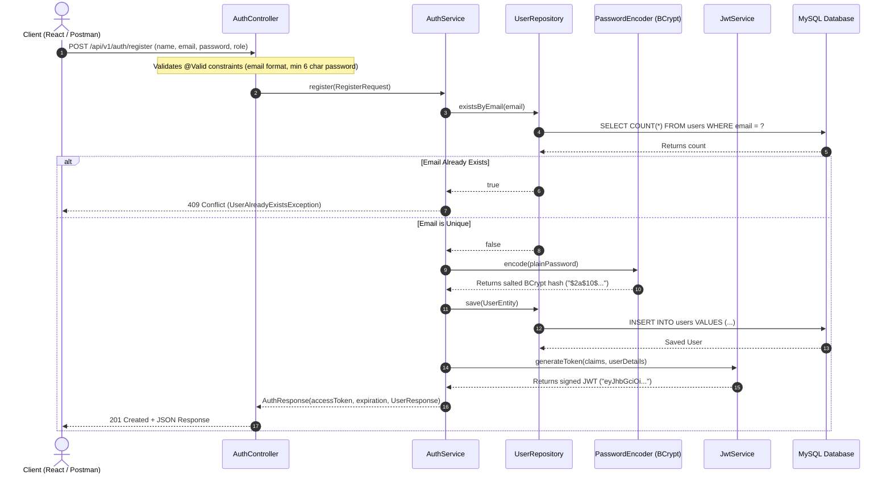
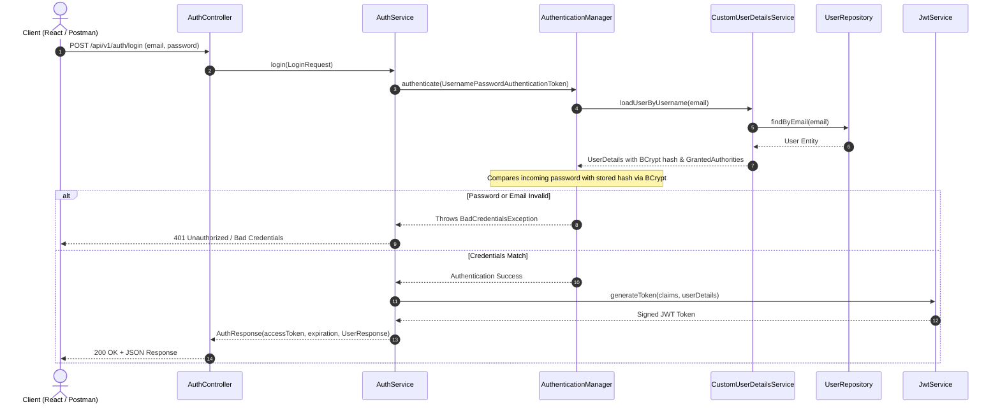
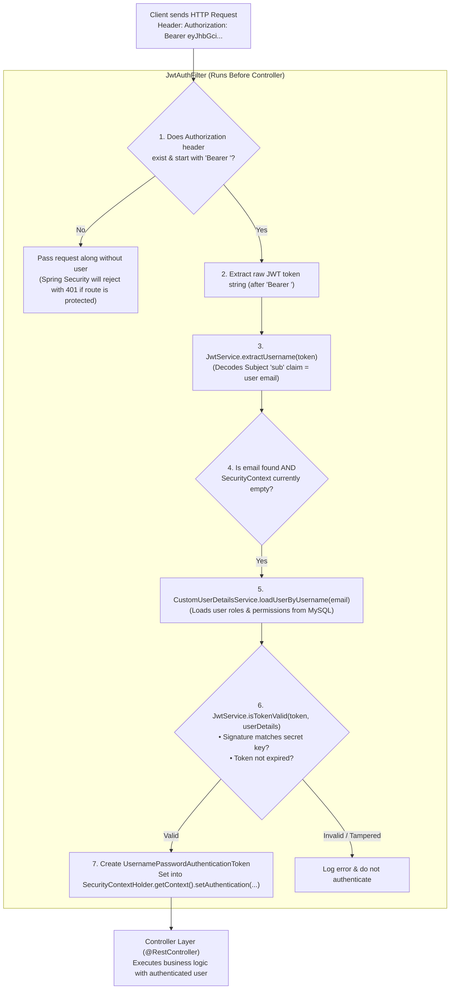

# Guide 04: User Authentication & JWT Architecture (Deep-Dive Guide)

> **Purpose**: This guide provides a **crystal-clear, non-technical friendly yet architecturally thorough** breakdown of the **User Registration, Login, and JWT Token Authentication** subsystem. It includes real-world analogies, step-by-step visual diagrams, PHP Laravel/Next.js comparisons, code explanations, and interview Q&As.

---

## 1. Non-Technical Real-World Analogy: Hotel Keycard & Reception

To understand how JWT authentication works without any technical jargon, imagine visiting a **Luxury Hotel**:

```
                              HOTEL ANALOGY FOR JWT AUTH
                              
  Guest (Client)                 Reception Desk (AuthService)          Hotel Room (Protected API)
       │                                     │                                     │
       │  1. "Hi, I'm John. Here is my ID"   │                                     │
       ├────────────────────────────────────►│ (Verifies in guest database)        │
       │                                     │                                     │
       │  2. Hands Guest a Digital Keycard   │                                     │
       │     (Signed with hotel secret stamp)│                                     │
       │◄────────────────────────────────────┤                                     │
       │                                                                           │
       │  3. Guest walks up to Room 302 and taps Keycard                           │
       ├──────────────────────────────────────────────────────────────────────────►│
       │                                                                           │
       │                                     4. Door Lock Scanner (JwtAuthFilter)  │
       │                                        • Checks hotel stamp (Signature)   │
       │                                        • Checks expiration (Valid today?) │
       │                                        • Checks room number (Role/Claim)  │
       │                                                                           │
       │  5. Door Unlocks! "Welcome Mr. John"                                      │
       │◄──────────────────────────────────────────────────────────────────────────┤
```

### The 4 Key Real-World Lessons:
1. **The Guest (Client)**: Your React/Next.js frontend or mobile app.
2. **The Reception Desk (`AuthService` & `AuthController`)**: Only visited **once** during Registration or Login to prove identity and receive a digital keycard.
3. **The Digital Keycard (`JWT Access Token`)**: A compact, tamper-proof token containing the user's ID, role, and expiration date, digitally signed with the server's secret key.
4. **The Room Door Lock (`JwtAuthFilter`)**: Every time the guest wants to access a room (order placement, wallet balance), the door lock scans the keycard locally **without having to call the reception desk every single time**.

---

## 2. Laravel / Next.js to Spring Boot Mental Map

If you have built auth in **PHP Laravel (Sanctum / Passport / Tymon JWT)** or **NextAuth.js / Node.js**, here is how each component translates directly:

| Responsibility | PHP / Laravel | Node / Next.js | Spring Boot Component | How it Works |
| :--- | :--- | :--- | :--- | :--- |
| **Incoming Payload Record** | FormRequest (`$request->validate()`) | Zod Schema / TypeScript Interface | **`RegisterRequest` / `LoginRequest` (Java Record)** | Validates inputs (`@Email`, `@NotBlank`, `@Size`) before running logic. |
| **Outgoing Safe Payload** | API Resource (`UserResource::make($user)`) | Response DTO / JSON serializer | **`UserResponse` / `AuthResponse` (Java Record)** | Ensures database password hashes are **never** returned in API responses. |
| **Database Table Model** | Eloquent Model (`class User extends Model`) | Prisma Model / TypeORM Entity | **`User` (JPA Entity `@Entity`)** | Maps directly to the `users` table in MySQL. |
| **Database Queries** | `User::where('email', $e)->first()` | Prisma `prisma.user.findUnique()` | **`UserRepository` (`JpaRepository`)** | Automatically generates optimized SQL queries (`findByEmail`). |
| **Database Adapter** | `EloquentUserProvider` | NextAuth Adapter / DB callback | **`CustomUserDetailsService`** | Connects Spring Security to MySQL to look up a user by email. |
| **Password Hasher** | `Hash::make()` / `bcrypt()` | `bcrypt.hash()` | **`PasswordEncoder` (`BCryptPasswordEncoder`)** | Salts and hashes passwords securely. |
| **JWT Token Engine** | `tymon/jwt-auth` or `firebase/php-jwt` | `jsonwebtoken` / `jose` | **`JwtService` (JJWT Library)** | Generates, cryptographically signs, and validates HMAC-SHA256 tokens. |
| **Auth Business Logic** | `AuthService` / `AuthController` | Auth Controller / Service | **`AuthService`** | Coordinates registration, password encryption, and login authentication. |
| **Request Interceptor / Middleware** | `Authenticate` / `auth:api` Middleware | Custom Express/Next Middleware | **`JwtAuthFilter` (`OncePerRequestFilter`)** | Reads `Authorization: Bearer <token>`, validates it, and sets user identity. |
| **HTTP Controller** | `AuthController.php` | Next.js API Route / Controller | **`AuthController.java`** | Thin controller that delegates requests directly to `AuthService`. |

---

## 3. Visual Execution & Data Flow Diagrams

### Flow 1: User Registration Sequence (`POST /api/v1/auth/register`)



---

### Flow 2: User Login Sequence (`POST /api/v1/auth/login`)



---

### Flow 3: Authenticated Request Pipeline (`JwtAuthFilter`)

When a logged-in user requests a protected endpoint (e.g. `GET /api/v1/orders`):



---

## 4. Component-by-Component Walkthrough

### 1. `User.java` (The JPA Entity)
* **What it is**: The Java class mapped directly to the `users` table in MySQL.
* **Key Fields**:
  * `id`: `Long` primary key with `@GeneratedValue(strategy = GenerationType.IDENTITY)`.
  * `name`: Full name.
  * `email`: Unique email constraint (`@Column(unique = true)`).
  * `password`: Stores the BCrypt salted hash (never plain text!).
  * `role`: Enum (`ROLE_USER`, `ROLE_ADMIN`).
  * `createdAt` & `updatedAt`: Automatic Hibernate timestamps at the bottom.


### 2. `UserRepository.java` (The Data Access Layer)
* **What it is**: Spring Data JPA interface.
* **Why it has no implementation code**: Spring Data JPA generates SQL queries automatically at runtime based on method names:
  * `findByEmail(String email)` ──► `SELECT * FROM users WHERE email = ?`
  * `existsByEmail(String email)` ──► `SELECT COUNT(*) > 0 FROM users WHERE email = ?` (super-fast index lookup).

### 3. `CustomUserDetailsService.java` (The Security Adapter)
* **What it is**: Implements Spring Security's `UserDetailsService`.
* **Why it exists**: Spring Security core has no idea what your MySQL table is named. This class acts as a bridge:
  ```java
  public UserDetails loadUserByUsername(String email) {
      User user = userRepository.findByEmail(email)
          .orElseThrow(() -> new UsernameNotFoundException("User not found: " + email));
      
      // Convert our Role enum into Spring Security's GrantedAuthority
      SimpleGrantedAuthority authority = new SimpleGrantedAuthority("ROLE_" + user.getRole().name());
      
      return new org.springframework.security.core.userdetails.User(
          user.getEmail(),
          user.getPassword(),
          Collections.singletonList(authority)
      );
  }
  ```

### 4. `JwtService.java` (The Cryptographic Token Service)
* **What it is**: Dedicated service for all JWT cryptographic operations (**Single Responsibility Principle**).
* **Key Methods**:
  * `generateToken(extraClaims, userDetails)`: Bundles `userId`, `role`, `email`, and expiration into a payload, signs it using **HMAC-SHA256** with our secret key from `application.yml`, and returns the compact base64 token string.
  * `extractUsername(token)`: Decodes the payload to read the email subject.
  * `isTokenValid(token, userDetails)`: Verifies cryptographic integrity and ensures the token expiration timestamp is in the future.

### 5. `AuthService.java` (The Business Orchestrator)
* **What it is**: Coordinates registration and authentication business rules.
* **Why `@Transactional` is used**:
  * In `register()`: Ensures that if any unexpected error occurs after hashing or during token generation, any partial database insert is cleanly rolled back (**ACID Atomicity**).
  * In `login()`: Annotated with `@Transactional(readOnly = true)` for optimized database read performance.

### 6. `JwtAuthFilter.java` (The Custom Middleware)
* **What it is**: Extends `OncePerRequestFilter` to ensure it executes exactly **once per incoming HTTP request**.
* **What it does**: Inspects the `Authorization` HTTP header, decodes the JWT, verifies its signature, loads the user's role authorities, and stores them in `SecurityContextHolder`.

### 7. `AuthController.java` (The Thin Controller)
* **What it is**: Paper-thin REST controller.
* **Golden Rule**: Controllers **never** contain business logic or SQL queries. Their only job is to:
  1. Receive the HTTP request.
  2. Trigger `@Valid` bean validation on request records.
  3. Delegate to `AuthService`.
  4. Return a `ResponseEntity<AuthResponse>` with appropriate HTTP status codes (`201 Created` for register, `200 OK` for login).

---

## 5. Architectural Principles & Design Decisions

### A. SOLID Principles in Action
1. **Single Responsibility Principle (SRP)**:
   * `JwtService` handles only token cryptography.
   * `AuthService` handles only user authentication logic.
   * `AuthController` handles only HTTP routing and status codes.
2. **Dependency Inversion Principle (DIP)**:
   * No hardcoded `new AuthService()` inside classes. All dependencies are `private final` fields injected automatically through constructors via Lombok's `@RequiredArgsConstructor`.
3. **Open/Closed Principle (OCP)**:
   * We implemented Spring Security's `UserDetailsService` interface without having to modify Spring Security's internal classes.

### B. DTO Protection & Encapsulation (Never Expose JPA Entities)
* **Problem**: Returning a raw JPA `User` entity to the client could accidentally leak sensitive fields like the hashed password, internal database IDs, or audit metadata.
* **Solution**: We strictly use Java Records:
  * `RegisterRequest` / `LoginRequest` for input.
  * `UserResponse` / `AuthResponse` for output.
  * Mapping is encapsulated in a clean static factory: `UserResponse.fromEntity(user)`.

---

## 6. Interview Questions & Talking Points

> **Q1: Why did you choose stateless JWT over traditional HTTP Sessions with Cookies?**
> * **Answer**: *"Stateless JWT authentication allows our Order Management backend to scale horizontally across multiple container instances without requiring sticky sessions or a shared Redis session cluster. Every request is self-contained and cryptographically verified on the fly."*

> **Q2: Why use BCrypt for passwords instead of SHA-256 or MD5?**
> * **Answer**: *"SHA-256 is designed to be computationally fast, making it susceptible to brute-force cracking and rainbow table lookups. BCrypt is an adaptive slow-hashing algorithm that incorporates a cryptographic salt and configurable work factor rounds, making hardware-accelerated dictionary attacks computationally impractical."*

> **Q3: What is the role of `SecurityContextHolder` in Spring Security?**
> * **Answer**: *"SecurityContextHolder is Spring Security's thread-local storage holding the Authentication token of the currently logged-in user. When `JwtAuthFilter` validates an incoming token, it populates the SecurityContextHolder so that any downstream service or controller can identify the user and verify their roles."*

> **Q4: How do you prevent N+1 queries when loading user relationships in Spring Data JPA?**
> * **Answer**: *"In our queries, we use `JOIN FETCH` or `@EntityGraph` to eagerly retrieve related entities in a single SQL JOIN query rather than executing separate lazy-loading queries inside loops."*

> **Q5: How do you handle JWT Token Invalidation (Logout / Blacklisting) in a stateless architecture?**
> * **Answer**: *"Because JWTs are self-contained and valid until their expiration timestamp, standard logouts require architectural patterns such as: (1) Storing revoked tokens in an in-memory Redis blacklist with a TTL matching the token's remaining lifespan, or (2) Using short-lived Access Tokens (e.g. 15 minutes) paired with rotating Refresh Tokens stored in the database, where logging out simply deletes the refresh token record."*

> **Q6: What are the security risks of storing sensitive user claims in a JWT payload?**
> * **Answer**: *"A JWT is digitally signed for integrity, but its payload is merely Base64URL encoded—not encrypted. Anyone who intercepts the token can decode and view its claims. Therefore, sensitive information such as passwords, payment credentials, or SSNs must never be placed in JWT claims; only non-sensitive identifiers like userId and roles should be included."*

> **Q7: What is the architectural difference between Symmetric (HMAC-SHA256) and Asymmetric (RSA/ECDSA) JWT signing?**
> * **Answer**: *"Symmetric signing uses a single shared secret key for both signing and verifying tokens, which works well in monolithic or internal applications. Asymmetric signing uses a Private Key on the Auth server to issue tokens and distributes a Public Key to downstream microservices/gateways, allowing them to verify tokens independently without knowing the signing secret."*

> **Q8: Why are Java Records preferred for DTOs in modern Spring Boot 3+ applications?**
> * **Answer**: *"Java Records provide immutable data carriers with concise syntax, eliminating boilerplate getters, `equals()`, `hashCode()`, and `toString()`. Their inherent immutability guarantees thread safety, prevents unexpected payload mutation between layers, and integrates seamlessly with Jackson 3 serialization."*

