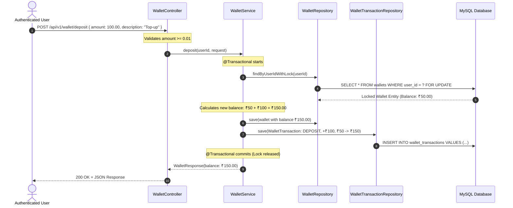
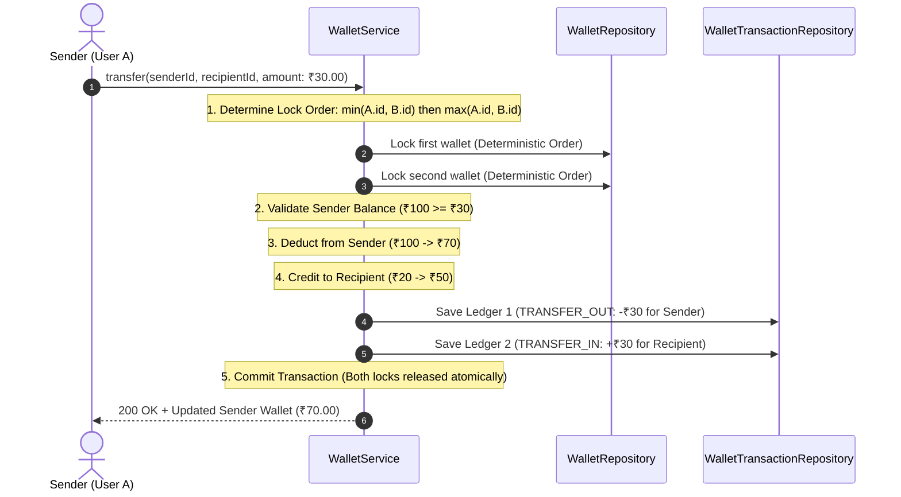

# Guide 05: Digital Wallet, Concurrency & Financial Ledger Architecture

> **Purpose**: This guide provides a comprehensive, non-technical friendly yet architecturally thorough explanation of the **Digital Wallet & Financial Ledger Subsystem**. It covers concurrency control, database row-level **Pessimistic Locking**, deadlock prevention, double-entry audit logging, INR (₹) currency handling, **auto-increment `Long` IDs (`GenerationType.IDENTITY`)**, an **Annotation Architecture Master Guide**, and product engineering interview questions.

---

## 1. Non-Technical Analogy: The Bank Vault & The Teller Window

Imagine a traditional physical bank:

```
                      REAL-WORLD ANALOGY: THE BANK VAULT
                      
  Customer A (Thread 1)               Teller Window (WalletService)         Vault Locker (MySQL Row)
       │                                     │                                  │
       │  1. "Withdraw ₹40 from Safe #7"     │                                  │
       ├────────────────────────────────────►│ 2. Teller grabs Key #7           │
       │                                     │    LOCKS Safe #7                 │
       │                                     ├─────────────────────────────────►│ [ LOCKED 🔒 ]
       │                                     │    (Safe contains: ₹100)         │
       │                                     │                                  │
  Customer B (Thread 2)                      │                                  │
       │  3. "Withdraw ₹50 from Safe #7"     │                                  │
       ├────────────────────────────────────►│ 4. Teller sees Safe #7 is LOCKED!│
       │                                     │    Customer B must WAIT in line. │
       │                                     │    (Cannot read or touch safe)   │
       │                                     │                                  │
       │                                     │ 5. Teller A takes ₹40 out,       │
       │                                     │    Writes in Ledger Book ───────►│ Balance: ₹60
       │                                     │    UNLOCKS Safe #7 ─────────────►│ [ UNLOCKED 🔓 ]
       │                                     │                                  │
       │                                     │ 6. Customer B gets turn:         │
       │                                     │    LOCKS Safe #7 ───────────────►│ [ LOCKED 🔒 ]
       │                                     │    Reads fresh balance: ₹60      │
       │                                     │    Takes ₹50, writes in Ledger──►│ Balance: ₹10
       │                                     │    UNLOCKS Safe #7 ─────────────►│ [ UNLOCKED 🔓 ]
```

### The 3 Golden Rules:
1. **The Safe Locker (`Wallet` row)**: Can only be opened by **one teller at a time**.
2. **The Lock Key (`Pessimistic Write Lock / SELECT ... FOR UPDATE`)**: Guarantees that while Customer A is adjusting the money, Customer B cannot sneak in and read the old ₹100 balance.
3. **The Ledger Book (`WalletTransaction` Audit Table)**: Every single rupee in or out is recorded as an immutable log entry with `beforeBalance`, `amount`, and `afterBalance`. The current balance is never just a random number—it is mathematically backed by the entire ledger history.

---

## 2. The Problem: The "Lost Update" Race Condition

Without database locking, simultaneous requests lead to the classic **Double-Spending / Lost Update Anomaly**:

```
                              WITHOUT LOCKING (RACE CONDITION)
                              
         Thread A (Withdraw ₹40)                              Thread B (Withdraw ₹50)
                   │                                                     │
                   ▼                                                     ▼
           1. Reads Balance: ₹100                                2. Reads Balance: ₹100
                   │                                                     │
           3. Calculates: 100 - 40 = ₹60                         4. Calculates: 100 - 50 = ₹50
                   │                                                     │
           5. Writes Balance: ₹60                                6. Writes Balance: ₹50 (OVERWRITES A!)
                   ▼                                                     ▼
                            FINAL DATABASE BALANCE = ₹50
                       (User withdrew ₹90, but only ₹50 was deducted! ₹40 lost!)
```

### How Pessimistic Locking Fixes It:

```
                            WITH PESSIMISTIC WRITE LOCKING
                            
         Thread A (Withdraw ₹40)                              Thread B (Withdraw ₹50)
                   │                                                     │
                   ▼                                                     │
      1. SELECT ... FOR UPDATE (Row Locked 🔒)                           │
         Reads Balance: ₹100                                             │
                   │                                                     ▼
                   │                                    2. SELECT ... FOR UPDATE
                   │                                       (BLOCKED! Waits for Thread A to release lock)
                   │                                                     │
      3. Calculates: 100 - 40 = ₹60                                      │
      4. Writes Balance: ₹60                                             │
      5. Writes Ledger Record                                            │
      6. COMMIT Transaction (Lock Released 🔓)                           │
                   │                                                     ▼
                   │                                    3. Lock Acquired 🔒
                   │                                       Reads updated Balance: ₹60
                   │                                    4. Calculates: 60 - 50 = ₹10
                   │                                    5. Writes Balance: ₹10
                   │                                    6. Writes Ledger Record
                   │                                    7. COMMIT (Lock Released 🔓)
                   ▼                                                     ▼
                            FINAL DATABASE BALANCE = ₹10 (100% Accurate!)
```

---

## 3. Laravel vs. Spring Boot Mental Map

If you are coming from **PHP Laravel** or **Node.js**, here is how every wallet concept maps directly:

| Financial Concept | PHP / Laravel | Node / Prisma / Express | Spring Boot Equivalent | Purpose in Plain English |
| :--- | :--- | :--- | :--- | :--- |
| **Row-Level Write Lock** | `Wallet::where('user_id', $id)->lockForUpdate()->first()` | `prisma.$queryRaw` or `SELECT ... FOR UPDATE` | **`@Lock(LockModeType.PESSIMISTIC_WRITE)`** | Locks the MySQL row until the transaction commits. |
| **Atomic Transaction** | `DB::transaction(function() { ... })` | `prisma.$transaction([...])` | **`@Transactional(rollbackFor = Exception.class)`** | Rolls back all DB changes if an error occurs. |
| **Monetary Precision** | `bcadd()` / `bcmul()` or integer paise/cents | `decimal.js` / BigInt paise | **`BigDecimal` (scale = 2)** | Prevents floating-point binary rounding errors (IEEE 754). |
| **Audit Ledger Model** | `class WalletTransaction extends Model` | `model WalletTransaction` | **`WalletTransaction` (`@Entity`)** | Immutable ledger table tracking every credit/debit. |
| **Input Validation** | FormRequest (`'amount' => 'required\|numeric\|min:0.01'`) | Zod (`z.number().positive()`) | **`@NotNull @DecimalMin("0.01")`** | Validates incoming amounts before reaching service logic. |

---

## 4. Visual Workflow & Execution Flows

### Flow A: Deposit Funds (`POST /api/v1/wallet/deposit`)



---

### Flow B: Peer-to-Peer Transfer & Deadlock Prevention (`POST /api/v1/wallet/transfer`)

When User A transfers money to User B, we must lock **two wallets**. If User A transfers to B while User B transfers to A simultaneously, we risk a **Deadlock**:

```
                         THE DEADLOCK HAZARD (Without Lock Ordering)
                         
             Thread 1 (A -> B)                                Thread 2 (B -> A)
                     │                                                │
             1. Locks Wallet A 🔒                             1. Locks Wallet B 🔒
             2. Requests Lock on Wallet B                     2. Requests Lock on Wallet A
                (Blocked by Thread 2!)                           (Blocked by Thread 1!)
                     └───► DEADLOCK DETECTED! Database must abort one transaction! ◄───┘
```

### The Solution: Deterministic Lock Ordering
We sort the user IDs numerically (`senderUserId < recipientUserId ? senderUserId : recipientUserId`). Both threads always attempt to lock the lower ID first, so one thread waits immediately, completely eliminating circular deadlocks.



---

## 5. Component Breakdown

### 1. `Wallet.java` (The Core Balance Entity)
```java
@Entity
@Table(name = "wallets")
@Getter
@Setter
@NoArgsConstructor
@AllArgsConstructor
@Builder
public class Wallet {

    @Id
    @GeneratedValue(strategy = GenerationType.IDENTITY)
    private Long id;

    @Column(nullable = false, unique = true)
    private Long userId;

    @Column(nullable = false, precision = 19, scale = 2)
    @Builder.Default
    private BigDecimal balance = BigDecimal.ZERO.setScale(2, RoundingMode.HALF_EVEN);

    @Column(nullable = false, length = 3)
    @Builder.Default
    private String currency = "INR";

    @CreationTimestamp
    @Column(nullable = false, updatable = false)
    private LocalDateTime createdAt;

    @UpdateTimestamp
    @Column(nullable = false)
    private LocalDateTime updatedAt;
}
```

### 2. `WalletTransaction.java` (The Immutable Ledger Entity)
* Every financial transaction creates an immutable record that can **never be edited or deleted** (`updatable = false`).
* Records: `type` (`DEPOSIT`, `WITHDRAWAL`, `ORDER_PAYMENT`, `TRANSFER_IN`, `TRANSFER_OUT`), `amount`, `beforeBalance`, `afterBalance`, `status`, and `referenceId`.
* Timestamps (`createdAt`) are placed at the bottom of the entity.

### 3. `WalletRepository.java` (Pessimistic Query Definition)
```java
public interface WalletRepository extends JpaRepository<Wallet, Long> {

    Optional<Wallet> findByUserId(Long userId);

    @Lock(LockModeType.PESSIMISTIC_WRITE)
    @Query("SELECT w FROM Wallet w WHERE w.userId = :userId")
    Optional<Wallet> findByUserIdWithLock(@Param("userId") Long userId);

    @Lock(LockModeType.PESSIMISTIC_WRITE)
    @Query("SELECT w FROM Wallet w WHERE w.id = :id")
    Optional<Wallet> findByIdWithLock(@Param("id") Long id);
}
```

---

## 6. Passbook & Statement Endpoint Reference

| Endpoint | Method | Purpose | Query Parameters / Body |
|:---|:---|:---|:---|
| `/api/v1/wallet` | `GET` | Retrieve wallet balance & currency | None |
| `/api/v1/wallet/deposit` | `POST` | Deposit funds with pessimistic lock | `{ "amount": 100.00, "description": "Top-up" }` |
| `/api/v1/wallet/withdraw` | `POST` | Withdraw funds with balance check | `{ "amount": 40.00, "description": "ATM" }` |
| `/api/v1/wallet/transfer` | `POST` | P2P transfer with deadlock-safe locking | `{ "recipientUserId": 2, "amount": 30.00, "description": "Lunch" }` |
| `/api/v1/wallet/transactions` | `GET` | List all historical transactions | None |
| `/api/v1/wallet/passbook` | `GET` | Digital passbook with summary & pagination | `page` (default 0), `size` (default 10), `type` (optional filter) |

---

## 7. Comprehensive Annotation Architecture Guide

Here is the exhaustive master reference of **every single annotation** used across our Spring Boot project, why it is used, and which Java package / Maven module it originates from:

### A. JPA & Hibernate Persistence Layer (`jakarta.persistence.*`, `org.hibernate.annotations.*`)

| Annotation | Package / Module | Why We Use It In This Project |
| :--- | :--- | :--- |
| **`@Entity`** | `jakarta.persistence` | Marks Java classes (`User`, `Wallet`, `WalletTransaction`) as relational database table mappings managed by Hibernate ORM. |
| **`@Table`** | `jakarta.persistence` | Explicitly specifies the database table name (`users`, `wallets`, `wallet_transactions`) and defines table-level indexes (`@Index`). |
| **`@Id`** | `jakarta.persistence` | Designates the field (`id`) as the primary key of the database entity. |
| **`@GeneratedValue`** | `jakarta.persistence` | Configures primary key generation. We use `strategy = GenerationType.IDENTITY` for PostgreSQL Identity / MySQL Auto-Increment `BIGINT`. |
| **`@Column`** | `jakarta.persistence` | Customizes column mapping: nullability (`nullable = false`), uniqueness (`unique = true`), precision/scale (`precision = 19, scale = 2` for `BigDecimal`), and immutability (`updatable = false`). |
| **`@Enumerated`** | `jakarta.persistence` | Configures Enum persistence. We use `EnumType.STRING` so enums (`ROLE_USER`, `DEPOSIT`) are stored as readable VARCHAR text instead of fragile numeric integers (`ORDINAL`). |
| **`@CreationTimestamp`** | `org.hibernate.annotations` | Automatically populates `createdAt` timestamp with current UTC system time upon initial `INSERT`. |
| **`@UpdateTimestamp`** | `org.hibernate.annotations` | Automatically refreshes `updatedAt` timestamp whenever the entity record is updated via `UPDATE`. |
| **`@Lock`** | `org.springframework.data.jpa.repository` | Instructs Spring Data JPA to apply row-level locking. `LockModeType.PESSIMISTIC_WRITE` emits `SELECT ... FOR UPDATE` in MySQL/Postgres. |
| **`@Query`** | `org.springframework.data.jpa.repository` | Defines custom JPQL/HQL queries when method naming conventions are insufficient or explicit row locks are needed. |
| **`@Param`** | `org.springframework.data.repository.query` | Binds method arguments to named parameters (e.g. `:userId`) inside `@Query` statements. |

---

### B. Spring Core, Web & Transactions (`org.springframework.*`)

| Annotation | Package / Module | Why We Use It In This Project |
| :--- | :--- | :--- |
| **`@RestController`** | `org.springframework.web.bind.annotation` | Combines `@Controller` and `@ResponseBody`. Tells Spring to serialize all returned objects directly into JSON HTTP response bodies. |
| **`@Service`** | `org.springframework.stereotype` | Marks service classes (`WalletService`, `AuthService`, `JwtService`) as Spring-managed singleton beans in the IoC container. |
| **`@RequestMapping`** | `org.springframework.web.bind.annotation` | Sets the base URL path prefix for all endpoints in a controller (e.g. `/api/v1/wallet`). |
| **`@GetMapping` / `@PostMapping`** | `org.springframework.web.bind.annotation` | Shortcuts for `@RequestMapping(method = RequestMethod.GET/POST)`. Maps HTTP verbs to handler methods. |
| **`@RequestBody`** | `org.springframework.web.bind.annotation` | Deserializes the incoming JSON HTTP request body into a strongly-typed Java DTO record. |
| **`@RequestParam`** | `org.springframework.web.bind.annotation` | Binds URL query string parameters (e.g. `?page=0&size=10&type=DEPOSIT`) to method parameters. |
| **`@Transactional`** | `org.springframework.transaction.annotation` | Manages database transaction boundaries via Spring AOP proxies. Commits on success, automatically rolls back on runtime exceptions. |
| **`@AuthenticationPrincipal`** | `org.springframework.security.core.annotation` | Injects the authenticated `UserDetails` of the logged-in user directly into controller methods from Spring Security's `SecurityContext`. |
| **`@Configuration`** | `org.springframework.context.annotation` | Marks a class as a source of Spring Bean definitions (e.g. `SecurityConfig`, `OpenApiConfig`). |
| **`@Bean`** | `org.springframework.context.annotation` | Declares a Spring-managed bean method (e.g. `passwordEncoder()`, `authenticationManager()`, `securityFilterChain()`). |

---

### C. Jakarta Validation (`jakarta.validation.*`)

| Annotation | Package / Module | Why We Use It In This Project |
| :--- | :--- | :--- |
| **`@Valid`** | `jakarta.validation` | Placed on `@RequestBody` parameters in controllers to trigger automatic validation of all bean constraints before executing business logic. |
| **`@NotNull`** | `jakarta.validation.constraints` | Ensures a field (like `amount`, `recipientUserId`, `role`) is not null. |
| **`@NotBlank`** | `jakarta.validation.constraints` | Ensures a String field is not null and contains at least one non-whitespace character (used for `name`, `email`, `password`). |
| **`@Email`** | `jakarta.validation.constraints` | Validates that a string matches a standard RFC-5322 email format. |
| **`@Size`** | `jakarta.validation.constraints` | Enforces minimum/maximum string length (e.g. password must be at least 6 characters). |
| **`@DecimalMin`** | `jakarta.validation.constraints` | Validates that a `BigDecimal` amount is greater than or equal to a minimum value (e.g. `@DecimalMin("0.01")`). |

---

### D. Swagger & OpenAPI 3.0 Documentation (`io.swagger.v3.oas.annotations.*`)

| Annotation | Package / Module | Why We Use It In This Project |
| :--- | :--- | :--- |
| **`@OpenAPIDefinition`** | `io.swagger.v3.oas.annotations` | Defines global OpenAPI metadata (Title, Version, Description, Contact info). |
| **`@SecurityScheme`** | `io.swagger.v3.oas.annotations.security` | Configures JWT Bearer authentication globally in Swagger UI (`type = HTTP, scheme = "bearer", bearerFormat = "JWT"`). |
| **`@SecurityRequirement`** | `io.swagger.v3.oas.annotations.security` | Attaches security requirements (`BearerAuth`) to a controller or endpoint, rendering the lock icon 🔒 in Swagger. |
| **`@Tag`** | `io.swagger.v3.oas.annotations.tags` | Groups related endpoints into logical visual categories in Swagger UI (e.g. "Wallet", "Authentication"). |
| **`@Operation`** | `io.swagger.v3.oas.annotations` | Describes the specific business purpose and behavior of an individual HTTP endpoint. |
| **`@ApiResponse` / `@ApiResponses`** | `io.swagger.v3.oas.annotations.responses` | Documents possible HTTP status codes (`200 OK`, `400 Bad Request`, `401 Unauthorized`, `409 Conflict`) and response schemas. |
| **`@Schema`** | `io.swagger.v3.oas.annotations.media` | Documents DTO model properties, providing field descriptions, data types, and realistic UI example values (e.g. `example = "150.00"`). |

---

### E. Project Lombok (`lombok.*`)

| Annotation | Package / Module | Why We Use It In This Project |
| :--- | :--- | :--- |
| **`@Getter` / `@Setter`** | `lombok` | Automatically generates standard getters and setters at compile time, eliminating boilerplate. |
| **`@NoArgsConstructor`** | `lombok` | Generates a no-argument constructor required by Hibernate/JPA entity reflection. |
| **`@AllArgsConstructor`** | `lombok` | Generates a constructor with one parameter for every field, required by the `@Builder` pattern. |
| **`@Builder`** | `lombok` | Implements the **Builder Pattern**, allowing fluent object creation: `Wallet.builder().userId(1L).balance(...).build()`. |
| **`@RequiredArgsConstructor`** | `lombok` | Generates a constructor for all `private final` fields, enabling clean **Constructor-based Dependency Injection** without `@Autowired`. |
| **`@Slf4j`** | `lombok.extern.slf4j` | Generates a private static SLF4J logger instance: `private static final Logger log = LoggerFactory.getLogger(...)`. |

---

## 8. Product Engineering & Annotation Interview Questions

### Q1: Why use `@GeneratedValue(strategy = GenerationType.IDENTITY)` over `GenerationType.AUTO` or `UUID`?
> **Answer**:
> * **`IDENTITY`**: Relies on the database's native auto-increment column (`AUTO_INCREMENT` in MySQL / `IDENTITY` / `BIGSERIAL` in PostgreSQL). It produces sequential, compact 64-bit integer IDs (`1, 2, 3, 4...`) that are human-friendly and optimize database B-Tree index locality.
> * **`AUTO`**: Delegates the choice to Hibernate. In MySQL, it defaults to `TABLE` or `SEQUENCE`, which can create extra table locks and degrade performance.
> * **`UUID` vs `Long`**: While UUIDs allow client-side key generation in distributed systems, they consume 128 bits (16 bytes), cause B-Tree index fragmentation upon insertion due to randomness, and are difficult for humans to read in SQL queries and logs.

---

### Q2: How does Spring's `@Transactional` work under the hood, and what causes it to fail?
> **Answer**:
> * **Under the hood**: Spring uses **CGLIB Dynamic Proxies** (AOP). When a caller invokes a `@Transactional` method, the proxy intercepts the call, obtains a database connection from `HikariCP`, sets `autocommit = false`, executes the target method, and calls `commit()` if no unhandled exception occurred, or `rollback()` if a `RuntimeException` was thrown.
> * **Self-Invocation Gotcha**: If Method A calls Method B in the *same class*, it bypasses the Spring proxy (`this.methodB()`), meaning `@Transactional` on Method B will **silently not work**.
> * **Exception Types**: By default, `@Transactional` only rolls back on unchecked exceptions (`RuntimeException` and `Error`). For checked exceptions, you must explicitly declare `@Transactional(rollbackFor = Exception.class)`.

---

### Q3: Why is Constructor Injection (`@RequiredArgsConstructor`) strongly preferred over Field Injection (`@Autowired`)?
> **Answer**:
> 1. **Immutability**: Allows dependencies to be declared as `private final`, ensuring they cannot be modified after object construction.
> 2. **Unit Testability**: Classes can be instantiated directly in JUnit tests with simple `new MyService(mockRepo)` without needing a full Spring Context or reflection hacks.
> 3. **Fail-Fast Detection of Circular Dependencies**: The application context fails to start immediately if a circular dependency exists, rather than encountering null pointer exceptions at runtime.
> 4. **Prevents Null Pointer Violations**: Guarantees that no object can ever be instantiated in an incomplete, uninitialized state.

---

### Q4: Explain the difference between `@NotNull`, `@NotEmpty`, and `@NotBlank` in Jakarta Validation.
> **Answer**:
> * **`@NotNull`**: Ensures the value is not `null`. An empty string `""` or whitespace string `"   "` is considered valid. Used for non-string objects (`BigDecimal amount`, `Long userId`, `Role role`).
> * **`@NotEmpty`**: Ensures the value is not `null` AND its length/size is greater than 0. A whitespace string `"   "` is still considered valid. Used for collections and strings.
> * **`@NotBlank`**: Ensures the value is not `null`, not empty, and contains at least one non-whitespace character (trims before checking). Used exclusively for user text inputs (`name`, `email`, `password`).

---

### Q5: Why must Enum database mappings use `@Enumerated(EnumType.STRING)` instead of `EnumType.ORDINAL`?
> **Answer**:
> * By default, JPA uses `EnumType.ORDINAL`, storing the numeric index of the enum constant (`0, 1, 2...`).
> * If a developer later reorders or inserts an enum value into the Java code (e.g. inserting `REFUND` before `DEPOSIT`), all previously stored database rows will instantly become corrupted and map to the wrong enum value!
> * `EnumType.STRING` stores the literal name as a VARCHAR (`"DEPOSIT"`, `"WITHDRAWAL"`), making the database schema self-documenting and immune to Java enum reordering.

---

### Q6: How does `@Lock(LockModeType.PESSIMISTIC_WRITE)` prevent the "Lost Update" anomaly?
> **Answer**:
> * In high-concurrency environments, multiple threads reading the same account balance simultaneously will calculate and overwrite each other's debits.
> * `@Lock(LockModeType.PESSIMISTIC_WRITE)` translates to `SELECT ... FOR UPDATE` in SQL.
> * When Thread 1 reads the wallet row, MySQL places an exclusive row-level X-lock on that record. Thread 2 is physically blocked from reading or writing that row until Thread 1's transaction commits.
> * Thread 2 then reads the fresh, post-debit balance, preventing double-spending and lost updates.

---

### Q7: How does `@AuthenticationPrincipal` retrieve the current user in controller methods?
> **Answer**:
> * In the filter chain, `JwtAuthFilter` parses the incoming JWT token, validates its signature, loads the user's `UserDetails`, and creates a `UsernamePasswordAuthenticationToken`.
> * It stores this token in the ThreadLocal storage via `SecurityContextHolder.getContext().setAuthentication(auth)`.
> * When a controller endpoint with `@AuthenticationPrincipal UserDetails userDetails` is executed, Spring's `AuthenticationPrincipalArgumentResolver` automatically extracts the principal object directly from the `SecurityContextHolder` for that request thread.

---

### Q8: How is the DRY (Don't Repeat Yourself) principle enforced in financial ledger and transaction processing pipelines?
> **Answer**:
> 1. **Centralized Ledger Record Creation**: Rather than duplicating `WalletTransaction.builder()...save()` across deposits, withdrawals, and P2P transfers, we extract a reusable `createAndSaveTransaction(...)` method.
> 2. **Generic Passbook Aggregations**: Passbook summary calculations (summing deposits, withdrawals, transfers) reuse a single `sumTransactions(List<WalletTransaction>, TransactionType...)` method with a `Set<TransactionType>` filter rather than 4 separate Stream reduction pipelines.
> 3. **Consistent Monetary Scale**: All arithmetic scaling (`setScale(2, RoundingMode.HALF_EVEN)`) is routed through a single `scaleAmount()` helper to ensure absolute precision consistency across the entire ledger.

---

### Q9: Why must financial audit columns (`createdAt`, `updatedAt`) and ledger records use `updatable = false`?
> **Answer**:
> * Financial regulations (such as SOX, PCI-DSS, RBI audit standards) require an immutable audit trail.
> * Setting `@Column(updatable = false)` at the JPA layer ensures Hibernate will completely omit those columns from generated SQL `UPDATE` statements, preventing any programmatic tampering or accidental overwriting of historical ledger entries.

